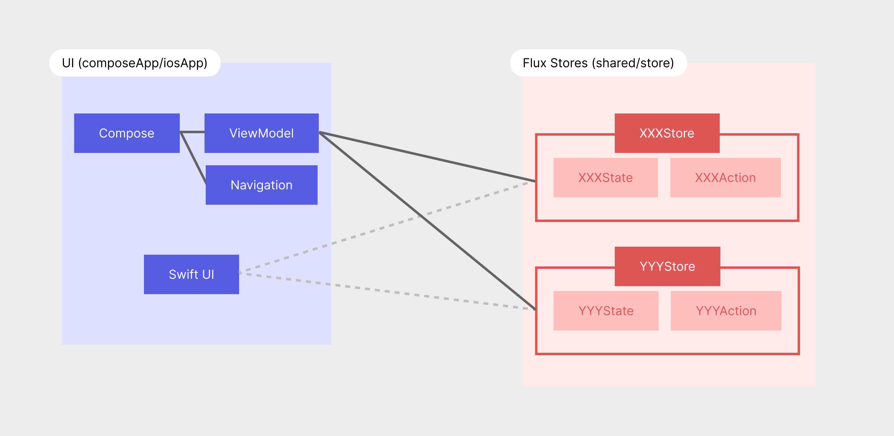

# Triple Triad

## 技術スタック

- Jetpack Compose
- KMP

## アーキテクチャ

### 概要

本アプリではベースのアーキテクチャとして **Flux アーキテクチャ** が採用されています。
[Zustand](https://github.com/pmndrs/zustand) を参考に、幾つかのStoreを使用しています。

## モジュール・パッケージの構成

### 全体像

- [composeApp module](#composeapp-module)
- [iosApp module](#iosapp-module)
- [shared module](#shared-module)

### 詳細

#### composeApp module

Androidアプリを構築するためのモジュール。

- composeApp
    - src/androidMain/kotlin/
        - App ... アプリの実装。
        - me/tbsten/tripletriad/
            - MainActivity.kt ... アプリのエントリーポイント

#### shared module

FluxのStoreやRepositoryなど、両OSで共通するドメイン層のコードを格納します。

- shared
    - src/commonMain/kotlin/
        - me/tbsten/tripletriad/shared/
            - data/ ... Repositoryなどを配置する。
            - store/ ... 各Storeと関連するState, Actionを配置する。
            - flux/ ... 独自のfluxライブラリ。将来 fluxライブラリが推奨される出てきた際にはここのコードと置き換える。

#### iosApp module

現在は使用していません。将来的にiOS版をサポートすることになった際に使用される予定です。
